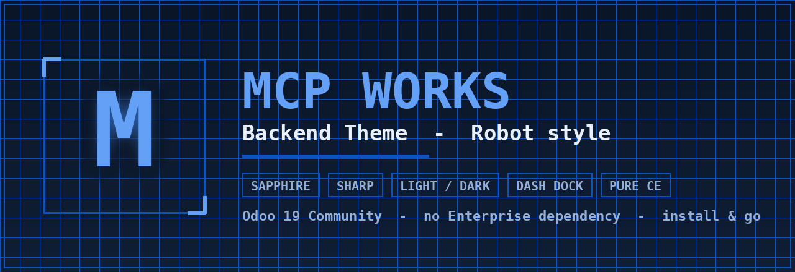

# MCP Works — Backend Theme (Robot style)

> A hi-tech, minimalist **“robot”** skin for the **Odoo 19 Community** backend —
> electric-sapphire accents, sharp corners, a fine blueprint mesh, seamless
> light/dark mode and a vertical *Dash* dock. **No Enterprise dependency.**

---

## ✨ Highlights

- **⚡ Independent & Community-first** — pure CE; depends only on `web` and
  `base_setup`, and explicitly excludes `web_enterprise`.
- **◆ Sharp “robot” identity** — electric-sapphire accent (`#0F52BA`),
  zero-radius corners, subtle blueprint grid, monospace “telemetry” labels.
- **☾ Light & Dark mode** — a calibrated dark theme ships alongside the light
  one; token-driven, accent legible on both grounds.
- **🎛️ Vertical “Dash” dock** — slim side app launcher (expand for names,
  collapse for icons).
- **🔤 Selectable UI font** — pick the interface typeface from *Settings*;
  applied before first paint (no flash).

## 🎨 Themed everywhere

Every core surface is calibrated, not just the navbar:

| | |
|---|---|
| List & Form views | Activity view |
| Kanban (flat cards, left-line hover, colour-safe) | Discuss (rail, composer, RTC call panel, notifications) |
| Calendar (sapphire today-marker, light event chips) | Settings (sapphire nav, sharp panels) |
| Pivot & Graph | Search panel, facets, dropdowns & controls |

## 📦 Requirements

- **Odoo 19.0 Community**
- Depends: `web`, `base_setup`

## 🚀 Installation

1. Copy `theme_mcp_works_backend` into your Odoo `addons` path.
2. *Apps → Update Apps List*.
3. Search **“MCP Works — Backend”** and install/activate.

The theme applies as soon as it is installed — there is no separate selector.
Toggle light/dark and pick the UI font from **Settings**.

---

## ⭐ Support & thanks

Made by **MCP Works** — independent Odoo work, crafted with ⚡.
Meet our **Odoo ↔ Claude MCP server** — the bridge that lets AI drive your Odoo:
**<https://github.com/rosenvladimirov/odoo-claude-mcp>**

**Enjoying the theme?** A single ⭐ star means a lot and keeps independent Odoo
tooling alive. Please star our MCP server as a thank-you:

👉 **[⭐ Star odoo-claude-mcp on GitHub](https://github.com/rosenvladimirov/odoo-claude-mcp)** — thank you!

## 📄 License

[AGPL-3.0-or-later](https://www.gnu.org/licenses/agpl-3.0). © MCP Works / Rosen Vladimirov.
